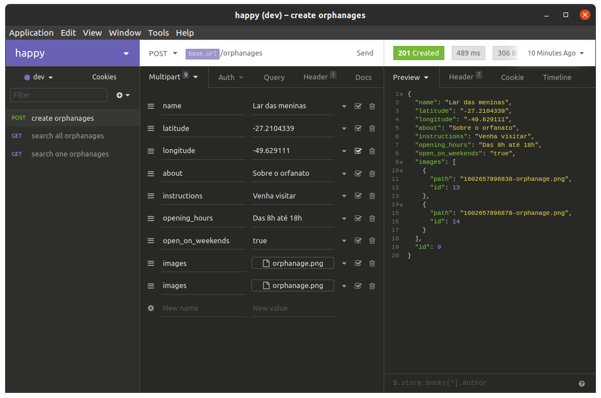

<p align="center" >
  
</p>

<br />

# :memo: About

Api developed at the event promoted by Rocketseat called next level week, where a complete application is developed.

This is an app created to bring people closer to orphanages making kids more happier and it's currently under development.

I'm using this project to improve my git knowledge, creating a real project flow with git flow.

# :rocket: Technologies
This project was developed with the following technologies:

- NodeJs
- Typescript
- Typeorm
- Sqlite3

# :heavy_check_mark: Routes

```bash 
POST '/orphanages' 

  {
    "name": string,
    "latitude": number,
    "longitude": number,
    "about": string,
    "instructions": string,
    "opening_hours": string,
    "open_on_weekends": boolean,
    "images": file
  }

GET '/orphanages' - list all

GET '/orphanages/:id' - list one
  ```

<p align="center" >
  
</p>
  

# :information_source: How to run:

```bash
# Clone this repository
$ git clone https://github.com/geovanicv/happy-api.git

# Go into the repository
$ cd happy-api

# Install dependencies
$ yarn

# Run the migrations
$ yarn typeorm migration:run

# Run the app
$ yarn dev

application running on port 3333
```


---
Made with :purple_heart: by Geovani Cavalcante :wave: [Get in touch!](https://www.linkedin.com/in/geovani-cv/)